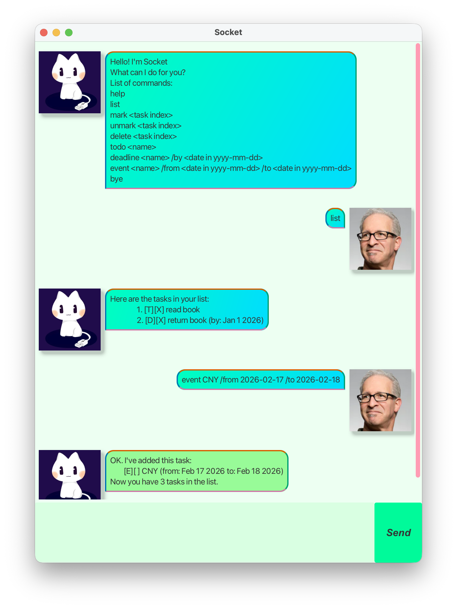

<!-- Referenced from AB3 user guide for features here: -->
<!-- https://se-education.org/addressbook-level3/UserGuide.html#features -->

# Socket User Guide

Socket is a chatbot that helps you keep track of your tasks.

---

## Quick Start
1. Ensure you have Java 17 or above installed in your Computer.

   Mac users: Ensure you have the precise JDK version prescribed
   [here](https://se-education.org/guides/tutorials/javaInstallationMac.html).
2. Download the latest `.jar` file from [here](https://github.com/song-yiyang/ip/releases). 
3. Copy the file to the folder you want to use as the home folder. 
4. Open a command terminal, `cd` into the folder you put the jar file in, and use the
   `java -jar socket.jar` command to run the application. A GUI similar to the above should appear in a few seconds.

---

## Features
### Viewing help: `help`
Prints a help message as well as a list of commands.
- Format: `help`

### List all tasks: `list`
Prints a list of all current tasks.
- Format: `list`

### Exit the application: `bye`
Exits the application.
- Format: `bye`

### Add new todo: `todo`
Adds a new todo task to the task list.
- Format: `todo <non-empty description>`
- Example: `todo Buy milk`

### Add new deadline: `deadline`
Adds a new deadline task with a specific due date to the task list.
- Format: `deadline <non-empty description> /by <date in yyyy-mm-dd>`
- Example: `deadline Buy flowers /by 2026-02-14`

### Add new event: `event`
Adds a new event with a start and end date to the task list.
- Format: `event <non-empty description> /from <date in yyyy-mm-dd> /to <date in yyyy-mm-dd>`
- Example: `event CNY /from 2026-02-17 /to 2026-02-18`

### Delete a task: `delete`
Deletes a task by its (1-)index.
- Format: `delete <index>`
- Example: `delete 1` deletes the first task.

### Mark a task as done: `mark`
Marks a task as done.
- Format: `mark <index>`
- Example: `mark 1` marks the first task as done.

### Mark a task as undone: `unmark`
Marks a task as undone.
- Format: `unmark <index>`
- Example: `unmark 1` marks the first task as undone.

### Filter for tasks: `find`
Filters all tasks whose descriptions contains the search string as a substring.
- Format: `find <search string>`
- Example: `find buy` matches the following descriptions: `buy milk`, `buyer's market`

---

## Saving and loading data
Task list data is saved in the hard disk automatically after any command that changes the data.
There is no need to save manually.

Data is saved in plaintext at `[JAR file location]/data/tasklist.txt`.
Advanced users are welcome to update data directly by editing that data file.
> Caution: Behavior is undefined if your edits to the data file render it unreadable by Socket.